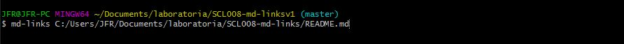
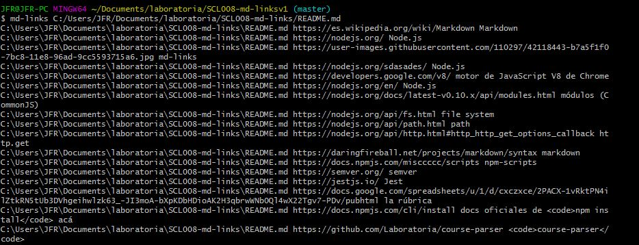
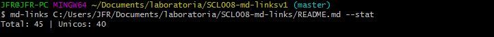
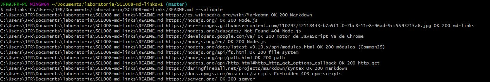
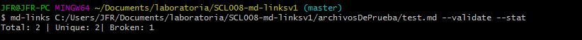

# jf-md-Links

## Introduccion

[Markdown](https://es.wikipedia.org/wiki/Markdown) es un lenguaje de marcado
ligero muy popular entre developers. Es usado en muchísimas plataformas que
manejan texto plano (GitHub, foros, blogs, ...), y es muy común
encontrar varios archivos en ese formato en cualquier tipo de repositorio
(empezando por el tradicional `README.md`).

Estos archivos `Markdown` normalmente contienen _links_ (vínculos/ligas) que
muchas veces están rotos o ya no son válidos y eso perjudica mucho el valor de
la información que se quiere compartir.

Md-links lee y analiza archivos
en formato `Markdown`, para verificar los links que contengan y reportar
algunas estadísticas.

## Instrucciones de instalación y uso

Esta librería cuenta con un ejecutable CLI via npm y una interfaz que podra ser importado con require, el detalle de cada uno a continuación.

Instalación vía npm

`npm i jf-md-links`

JavaScript API
Para utilizar este módulo programaticamente deberas importarlo en tu archivo .js así:

`const mdLinks = require('./md-links')`

El módulo ofrece la siguiente interfaz:

la forma de ingresar la información es llamando al modulo jf-md-links luego ingresando el archivo a analizar 

La ejecución por defecto muestra información básica de los links extraidos como: ruta del archivo, href y titulo

Al ingresar --stat estadisticas generales con respecto a los links extraídos como total de links y unicos

Al ingresar --validate se visualiza la ruta, href, status Code, status Text, titulo del archivo

Al ingresar ambas opciones se visualiza estadisticas generales con respecto a los links extraídos como total de links, unicos y rotos. 

## Proceso de planificación y construcción
foto planificacion inicial
foto guia en casa

### Archivos del proyecto

- `README.md` con descripción del módulo, instrucciones de instalación/uso,
  documentación del API y ejemplos. Todo lo relevante para que cualquier
  developer que quiera usar tu librería pueda hacerlo sin inconvenientes.
- `index.js`: Desde este archivo debes exportar una función (`mdLinks`).
  `mdLinks()`. Tu inplementación debe pasar estos tets.
- `md-links.js`:
- `logic.js`:
